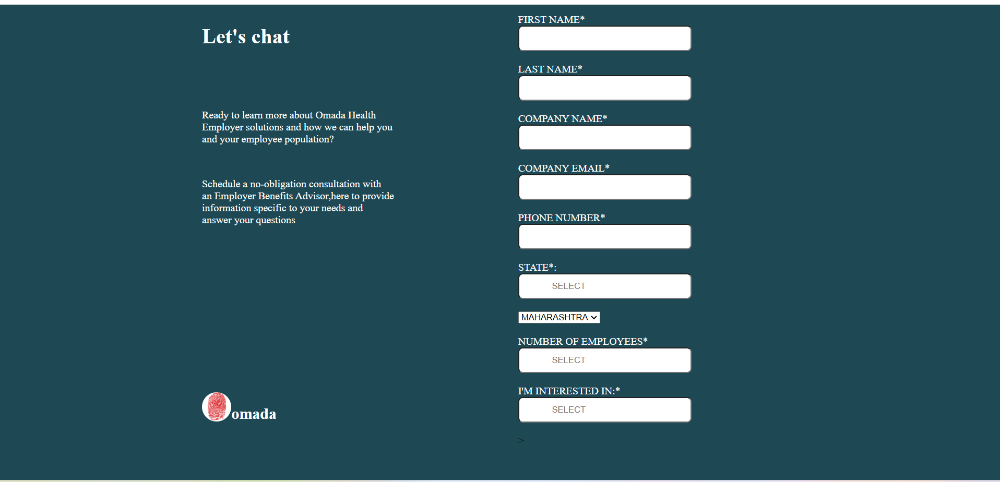
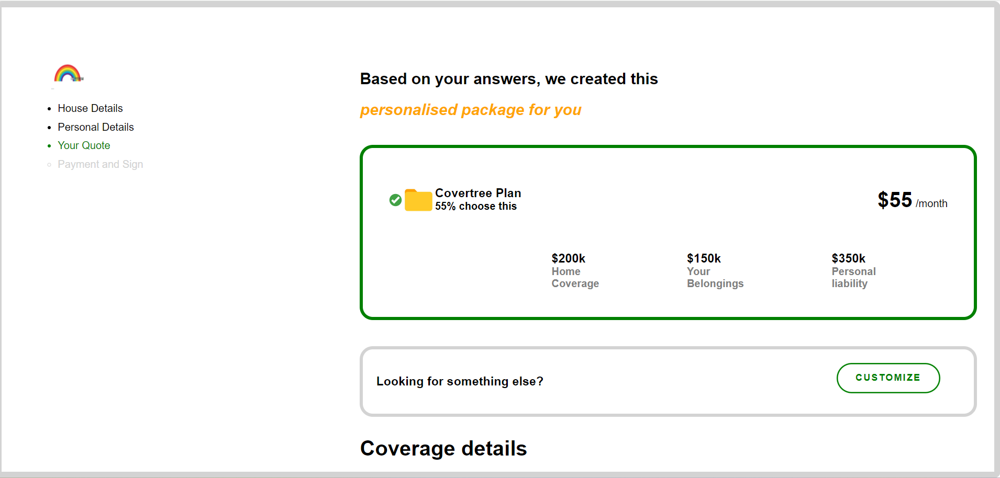

# Assignments

## Assignment1
- Basic portfolio website made with plain html
-  Completed the given task 

## Assignment2 
- Application of html forms tag 
- Completed the given task

## Assignment3
- Given task - Design two screens 
- Completed both screen 1 and screen 2 but used a lot of chatgpt,w3schools and stackoverflow
- i am quite less confident (would love to practice more and discuss concepts of flexbox,grid , media quieries etc (need to ask priyanka mam))
- *My Final Screenshot of Screen 1 and Screen 2*
 
 
